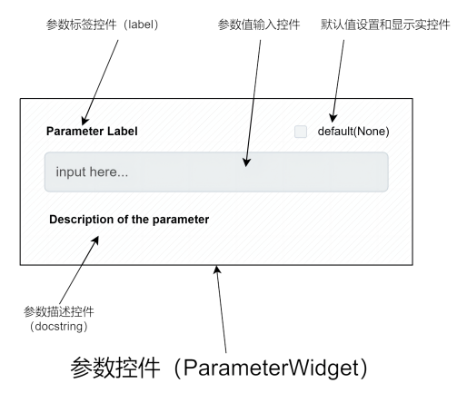
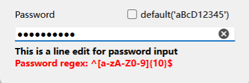

# function2widgets

----

## 一、简介

从函数签名和文档字符串中提取参数信息，并生成对应的GUI控件。

## 二、安装

```bash
pip install function2widgets
```

## 三、核心概念和基本组件

本框架基于以下核心概念和基本组件。

### （一）参数控件（Parameter Widget）

#### 1、基本概念
本框架主要做的一个事就是将函数的参数映射成GUI控件，这就是`参数控件`的概念，由于本框架基于`PyQt6`，因此，从本质上讲，所谓`参数控件`仍然是一个`QWidget`的子类。

只不过它针对`函数参数`这一特定场景，做了一些额外的约定，换言之，提供了一些特定的接口。 比如，`参数控件`规定，一个代表参数的控件：
 - 应当提供一个控件，用来显示参数的名称，这个控件被称为`label`，对应的方法为`set_label()`； 
 - 应当提供一个控件，用来显示参数的说明（通常是文档字符串中对该参数的描述），这个控件被称之为`docstring`，对应的方法为`set_docstring()`； 
 - 应当允许用户控制上述两个控件的显示和隐藏，对应的方法为`show_label()`和`show_docstring()`； 
 - 应当提供输入组件，方便用户输入参数的值，即：应当读写参数的值的接口，对应`set_value()`和`get_value()`方法；
 - 应当获取和设置参数默认值的方法，对应`default`属性

基于以上约定，本框架提供了`BaseParameterWidget`类，作为所有参数控件的基类。所有参数控件都应当继承自该类。

`BaseParameterWidget`是一个高度抽象的类，它不包含任何具体的实现，只定义了接口。

它不强制规定控件的布局和外观，比如它不关心标签和输入框是按行布还是按列布局的，用户可以自由选择控件的布局和外观，只要满足接口定义即可。

只不过，本框架内置的参数控件，遵循一个统一的布局方式，即`label` / `输入控件` / `docstring` 依次按行排列，如下图所示：



实际的例子（LineEdit）：




#### 2、内置的参数控件

本框架内置了大量的参数控件，涵盖`int`、`float`、`bool`、`str`、`list`、`tuple`、`dict`等类型参数，能够满足大部分使用场景。

如果要支持其他类型参数，可以参考`function2widgets.widgets`下的源码，创建适用于自定义参数的控件类型。

##### 2.1、line edits

单行输入框，用于输入字符串、数字等，包含：`LineEdit`、`IntLineEdit`、`FloatLineEdit`等具体实现。

源码参考：[function2widgets.widgets.lineedit](function2widgets/widgets/lineedit/stredit.py)

例子参考：[examples/lineedits/](examples/lineedit/)

文档参考：[lineedits.md](./docs/lineedits)

##### 2.2、number edits

数字输入组件，包含：`IntEdit`、`FloatEdit`等具体实现。

源码参考：[function2widgets.widgets.numberedit](./function2widgets/widgets/numberedit.py)

例子参考：[examples/numberedits/](examples/numberinput/)

文档参考：[numberedits.md](./docs/numberedits.md)


##### 2.3、path edits

路径输入组件，包含：`IntEdit`、`FloatEdit`等具体实现。

源码参考：[function2widgets.widgets.pathedit](./function2widgets/widgets/pathedit.py)

例子参考：[examples/pathedits/](examples/pathedit/)

文档参考：[pathedits.md](./docs/pathedits.md)

##### 2.3、select widgets

选择组件，包含：`IntEdit`、`FloatEdit`等具体实现。

源码参考：[function2widgets.widgets.selectwidget](function2widgets/widgets/selectwidget/selectwidget.py)

例子参考：[examples/selectwidgets/](examples/selectwidget/)

文档参考：[selectwidgets.md](./docs/selectwidgets.md)

##### 2.4、text edits

多行文本编辑组件，包含：`IntEdit`、`FloatEdit`等具体实现。

源码参考：[function2widgets.widgets.textedit](./function2widgets/widgets/textedit.py)

例子参考：[examples/textedits/](examples/textedit/)

文档参考：[textedits.md](./docs/textedits.md)

##### 2.5、code editors

基于QsciScintilla实现的代码编辑器组件，包含：`CodeEdit`、`PythonCodeEdit`等具体实现。

源码参考：[function2widgets.widgets.codeeditor](function2widgets/widgets/editor/codeeditor.py)

例子参考：[examples/codeeditors/](examples/codeeditor/)

文档参考：[codeeditors.md](./docs/codeeditors.md)

### （二）函数描述、参数描述与控件描述（FunctionDescription、ParameterDescription、WidgetDescription）

在本框架中，`描述(Description)`是代表一种数据类型，这种数据类型是对某种对象的抽象，而`解析器（Parser）`则是将某种对象转换为其`描述`的工具。

#### 1、ParameterDescription和FunctionDescription

`ParameterDescription`是对函数参数的抽象，它包含了函数参数的名称、类型、默认值、文档字符串等信息。

`FunctionDescription`是对函数的抽象，它包含了函数的名称、参数列表（由ParameterDescription组成的列表）、文档字符串等信息。

`FunctionDescriptionParser`是`FunctionDescription`的解析器，它从给定函数的签名、文档字符串等信息中解析出`FunctionDescription`。

同时，它会根据一定的规则，解析给定函数参数列表中的每一个参数，并生成对应的`ParameterDescription`。

#### 2、WidgetDescription

`WidgetDescription`是对参数控件的抽象，它包含了参数控件的类型、默认值、label、docstring即参数控件类的初始化参数等信息。

WidgetDescription的解析过程被包含在`FunctionInfoParser`中，而`FunctionInfoParser`是`FunctionDescriptionParser`的一部分。

`FunctionDescriptionParser`在解析函数参数时，会通过`FunctionInfoParser`将函数参数转换为`WidgetDescription`， 
而`WidgetDescription`则决定了参数控件如何创建。

一个参数如何转换为对应的`WidgetDescription`，一般而言，由该参数的类型决定。但也可以在函数的文档字符串中通过由@begin...@end
包裹的TOML格式的文本块来进行自定义。

```python
def foo(a: int):
    pass
```

在上面这个例子中，`a`参数的类型为`int`，因此在它的`WidgetDescription`中，`type`属性默认会被设置为`IntLineEdit`，
但是可以通过在函数的文档字符串中定义一个TOML格式的文本块来覆盖默认的设置：

```python
def foo(a: int):
    """
    
    @begin
    [a]
    type="IntSpinBox"
    label="a"
    docstring="this is a widget"
    @end
    """
    pass
```

在上述例子中，解析器将根据 @begin...@end包裹的TOML格式的文本块，来决定参数`a`的`WidgetDescription`中，其中：
`type`属性被设置为`IntSpinBox`，`label`属性被设置为`a`，`docstring`属性被设置为`this is a widget`。


### （三）参数控件工厂（ParameterWidgetFactory）

`ParameterWidgetFactory`是参数控件的工厂类，它负责根据`WidgetDescription`创建对应的参数控件。

内置的参数控件类型均已注册到工厂中，可以通过`ParameterWidgetFactory.register`方法来注册自定义的参数控件类型。