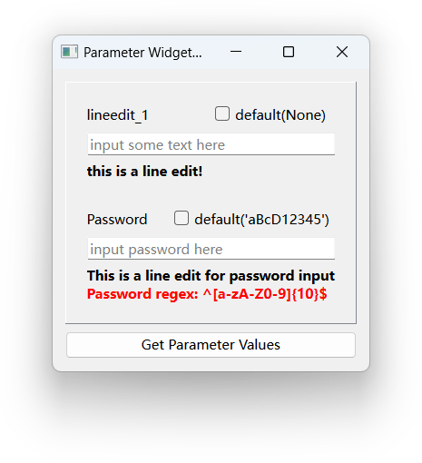
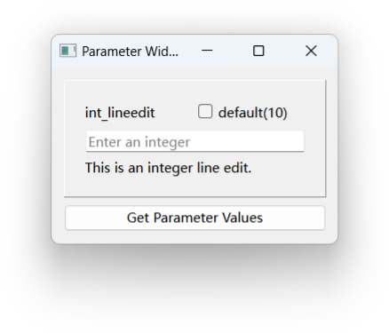
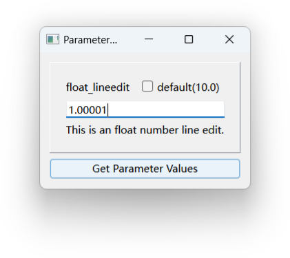

## LineEdit

用于输入字符串，支持`str`类型参数。

---

## IntLineEdit

用于输入整数，支持`int`类型参数。

**注意：当输入框无内容时，get_value()将返回None。**

---

## FloatLineEdit

用于输入浮点数，支持`float`类型参数。

**注意：当输入框无内容时，get_value()将返回None。**
